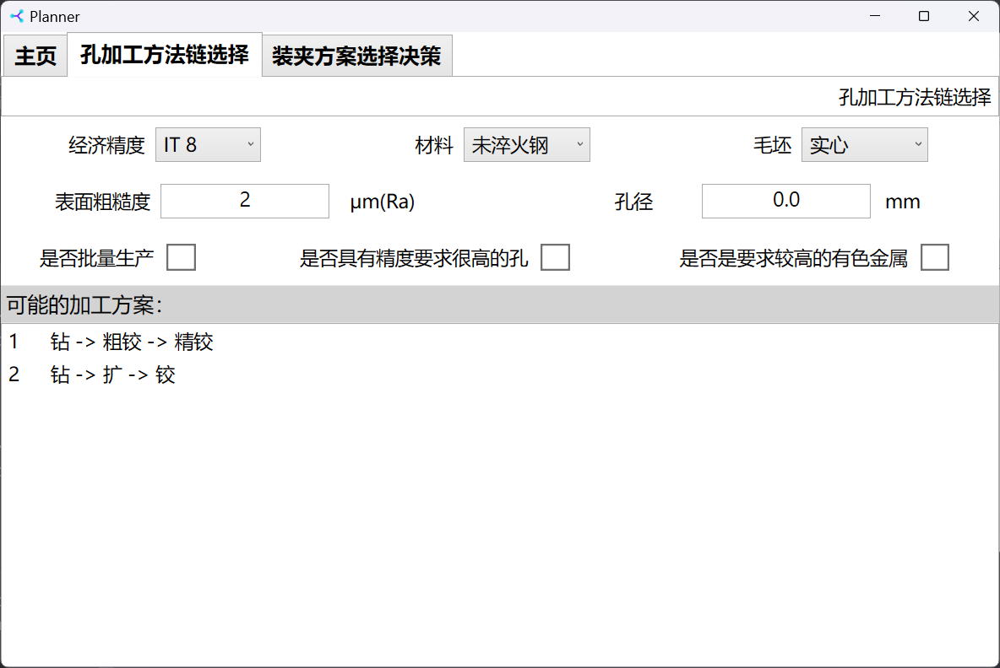
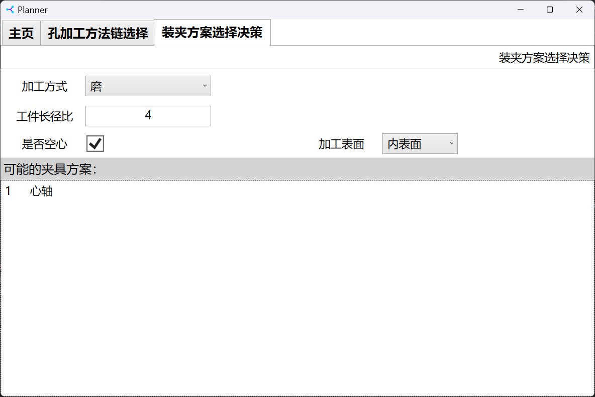

# Planner

Homework for BUAA 2023 Autumn Computer Aided Design And Manufacturing.

Copyright &copy; Tony's Studio 2023

---

## Screenshots

---

## Build Environment

It is developed using C# WPF, with Microsoft Visual Studio 2022 and Blend for Visual Studio 2022. Target framework is .NET 6.0